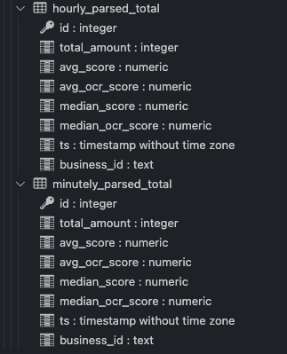
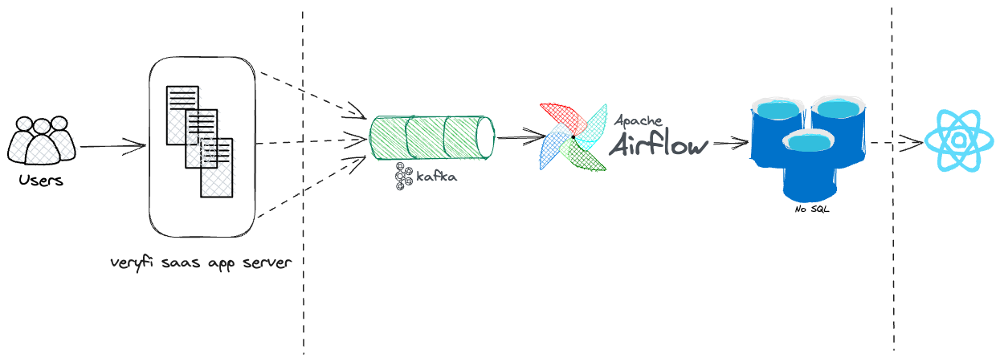

# OCR Analytics

[React app for real time analytics](https://keshav137.github.io/ocr_analytics/)

[Airflow instance](http://138.197.208.92:8080/home)

# Design

## Part 1

I setup a PostgresSQL instance using Docker on a linux virtual machine. In this instance, I created a database named `veryfidev`, and in this db, I created a table named `documents` (contains a `document_id` and an `ml_response` along with a `timestamp` column). I also added an index for this table where data is ordered by descending values of timestamp column, so that this data can be easily processed in batches in the right order.

Then I wrote a python script called `generate_data.py` ([link](https://github.com/keshav137/ocr_analytics/blob/main/backend/scripts/generate_data.py), [link](https://github.com/keshav137/ocr_analytics/blob/main/backend/scripts/helpers.py)) which adds 1 row per second for the past 1 week to the `documents` table, starting today(May 29). Each record contains 9 `line_items` which are generated randomly. These `line_items` are aggregated and stored in the `total` field inside the `ml_response` column. The aggregation function for `values` in `line_items` is `sum` and that for `scores` and `ocr_scores` is `mean`.

This script added 604,800 rows as sample data for the past 1 week (24 x 60 x 60 x 7) in the `documents` table.

## Part 2

I setup an instance of Apache airflow using docker compose on my virtual machine.

## Part 3

I created 2 new tables in PostgresSQL called `hourly_parsed_total` and `minutely_parsed_total` for storing analytics data shown below:

I added the following 2 DAGs in the Airflow instance to parse the past data from `documents` table and write it into the 2 new tables created above.

### Minutely Dag

[link](http://138.197.208.92:8080/dags/minutely_dag/grid?search=minutely_dag)

This DAG processes the past data from the `documents` table in batches, aggregates the data for each minute into one record and writes it to the `minutely_parsed_total` table.

The records are grouped by `business_id` so user can query analytics data for different businesses and compare their values. Each record stores aggregated values for total_amount, avg_score, avg_ocr_score, median_score, median_ocr_score, along with the associated timestamp(where seconds value is stripped) and the business_id.

### Hourly Dag

[link](http://138.197.208.92:8080/dags/hourly_dag/grid?search=hourly_dag)

This DAG is almost identical to the `minutely_dag`, except that it aggregates data by `hour` instead of minutes and writes it to the `hourly_parsed_total` table. The timestamp column in this table does not contain `seconds` and `minutes` info as the data is aggregated by hour and grouped by businessId.

Then I added another DAG to add live data to the `documents` table:

### Add Data Dag

[link](http://138.197.208.92:8080/dags/add_data_dag)

This DAG adds 10 new records every 10 seconds (one record for each second) to the `documents` table, imitating the real world case where new receipt data is being generated.

To process the live data being added to `documents` table, I created 2 more DAGs:

### Live Minutely Dag

[link](http://138.197.208.92:8080/dags/live_minutely_dag)

This dag runs every 5 minutes and processes minutely data for the past 5 minutes from the `documents` table and adds it to the `minutely_parsed_total` table

### Live Hourly Dag

[link](http://138.197.208.92:8080/dags/live_hourly_dag)

This dag runs every 1 hour and processes minutely data for the past 60 minutes from the `documents` table and adds it to the `hourly_parsed_total` table

## Part 4

For this part, I picked the 2nd option, where I created a Flask API to serve analytics data from the `minutely_parsed_total` and `hourly_parsed_total` tables to a React application which displays the analytics data using line charts.

The Flask API is running in tmux and is documented in this file:
[link](https://github.com/keshav137/ocr_analytics/blob/main/backend/scripts/server.py)

The user can filter the data by start date, end date and businessId, and also pick the type of analytics(either `hour` or `minute`) to plot.
By default the app shows analytics from yesterday and today's values.

User can compare analytic values across different businesses (by opening this app in multiple tabs and picking different filters).

These minutely analytics are updated every 5 mins and hourly analytics are updated every 1 hour in the live DAGs mentioned above. The new data processed by the DAGs is shown in these charts in near real time.

## Part 5

To scale this system, I would use Apache Kafka to process all the ml responses from the application servers.

This data will be then be processed by Airflow DAGs(similar to the ones listed above) - aggregated and persisted to a NoSQL database(which can easily be scaled horizontally).

The Airflow instance can be scaled using Celery Executor to distribute tasks across multiple workers. For near real-time analytics, a stream processing system like Apache Flink can also be used as it can consume data from Kafka, process it in real-time, and write the results back to a database. For proper monitoring and alerting, tools like Prometheus and Grafana can be used for maintaining the health of the system and catching issues early.

## Additional notes

All the files related to the backend for this project including the airflow dags are contained in the `backend` folder under this repo.
